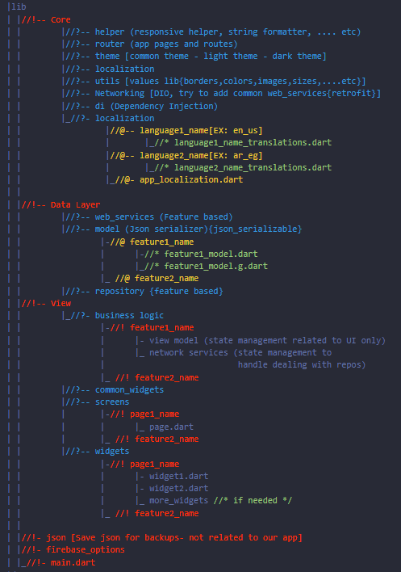

# Stylish Ecommerce

## Business Name: Stylish Ecommerce

Welcome to the Stylish Ecommerce project! This is an open-source project aimed at creating a stylish and user-friendly ecommerce platform. Whether you're a developer, designer, or business enthusiast, we invite you to contribute and be a part of shaping the future of online shopping experiences.

## Open Source

Stylish Ecommerce is an open-source project, which means that anyone can contribute, modify, and use the codebase freely. We believe in the power of collaboration and welcome developers and designers of all skill levels to join our community.

## Architecture

The architecture of Stylish Ecommerce is designed to be scalable, robust, and easily maintainable. We follow best practices to ensure a smooth development experience and a reliable product.

- **Technology Stack**: [Dart-Flutter]

- **API Collection**: [API Collection](https://www.getpostman.com/collections/94db931dc503afd508a5)

- **Architecture Overview**:

  

## Design Figma

The design of Stylish Ecommerce is crafted with precision and attention to detail. We use Figma as our primary design tool to create an intuitive and visually appealing user interface.

- **Design Cover**

  
- **Figma Design Files**: [Link to Figma files](https://www.figma.com/file/1GG80t9oygSW4emSHjSGW7/eCommerce-App-UI-Kit---Case-Study-Ecommerce-Mobile-App-UI-kit-(Community)?type=design&node-id=1%3A16990&mode=design&t=ogt50eOmogGH6PBg-1)

- **Design System**: [Link to design system documentation](https://www.figma.com/file/1GG80t9oygSW4emSHjSGW7/eCommerce-App-UI-Kit---Case-Study-Ecommerce-Mobile-App-UI-kit-(Community)?type=design&node-id=1%3A16990&mode=design&t=ogt50eOmogGH6PBg-1)

## Case Study

Explore the journey of Stylish Ecommerce through our detailed case study. Learn about the challenges we faced, the decisions we made, and the impact on the user experience.

---

**Get Involved!** Contribute to Stylish Ecommerce and help us create a fantastic ecommerce solution. Whether you're a developer, designer, or enthusiast, your ideas and contributions are valuable.

---
